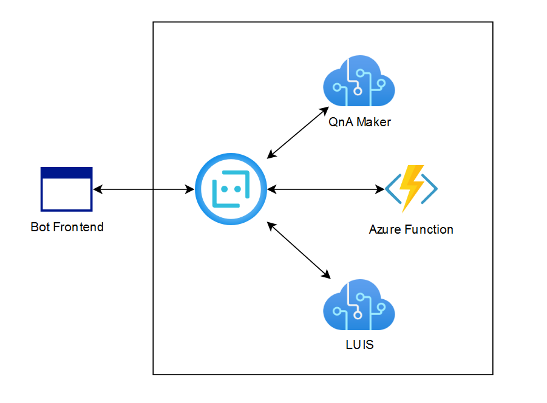
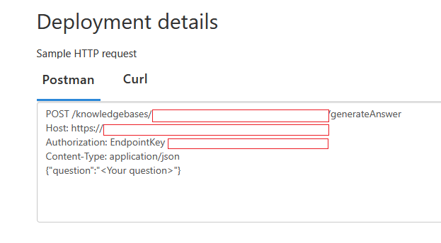
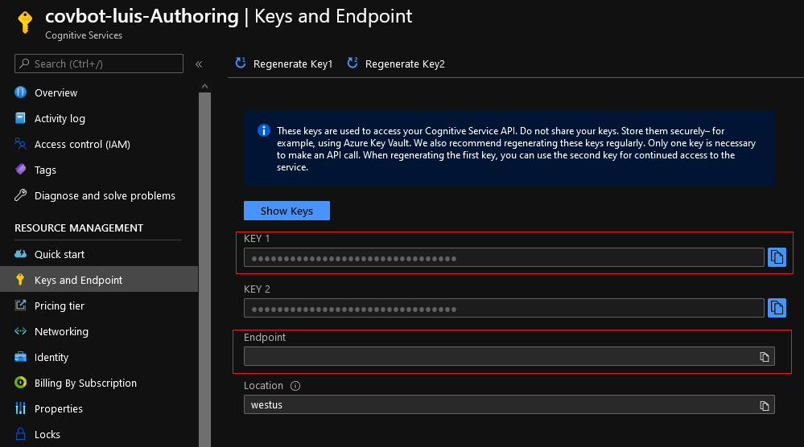
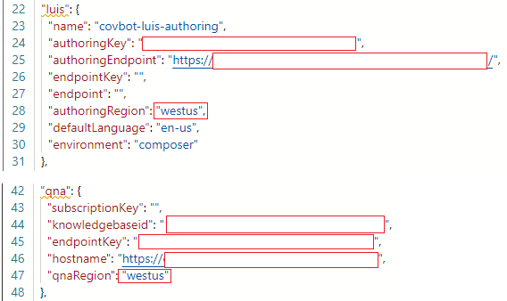

## Covid Helpline Bot

### Use Case:

This is a simple QnA bot created using [Bot Framework Composer](https://docs.microsoft.com/en-us/composer/introduction).

It integrates language understanding services ([LUIS](https://www.luis.ai/)) and [QnA Maker](https://www.qnamaker.ai/) and allows composition of bot replies using Language Generation.

It's knowledge base was build based on top of two main Covid-19 sites with verified informations in the form of a faq:
* [who.int](https://www.who.int/emergencies/diseases/novel-coronavirus-2019/question-and-answers-hub/q-a-detail/coronavirus-disease-covid-19)
* [cdc.gov](https://www.who.int/emergencies/diseases/novel-coronavirus-2019/question-and-answers-hub/q-a-detail/coronavirus-disease-covid-19)

Additionaly Azure function in python calls [free covid API](https://covid19api.com/) to check current statistics in the specified country. Data was split per city/province in some countries and had to be summarised.

### Architecture:

### How to recreate the bot:

1. Install [Bot Framework Composer](https://github.com/microsoft/BotFramework-Composer/releases) and [Bot Framework Emulator](https://github.com/Microsoft/BotFramework-Emulator/releases).
2. Open Bot Framework Composer, create a new bot (Create from template -> QnA Maker and LUIS).
3. Create new resource group on Azure.
4. Add QnA Maker Service to that group.
5. Add LUIS Service.
6. Login at [qnamaker.ai](https://www.qnamaker.ai/) and select created QnA service from the previous step.
7. Add selected sites as URL source for the knowledge base.
8. After importing the questions choose "Save and train".
9. Go to "PUBLISH" tab and confirm the process.
10. Copy knowledgebase id, host, and authorization EndpointKey.

11. Open Authoring Cognitive Services created in step 5., go to "Keys and Endpoint" and copy the key and the endpoint.

12. Paste the info in proper settings fields in the Bot Framework Composer.

13. Write and publish Azure function.
14. Modify bot flow using Design GUI.
15. Press "Start" in the upper-right corner, after successful build you can test the bot in Bot Framework Emulator.
