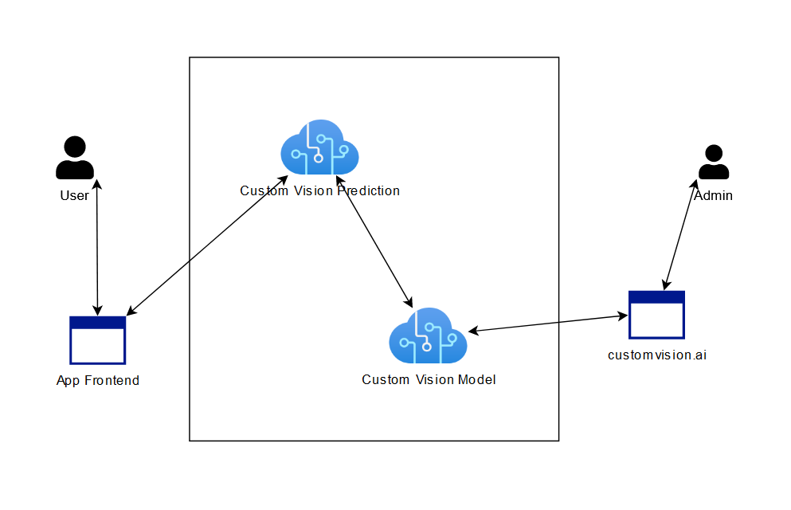

## Face Mask Recognizer

### Use Case:

This is a simple application that helps recognize if the person wears a facemask correctly.

This AI was created using [Custom Vision](https://docs.microsoft.com/en-us/azure/cognitive-services/custom-vision-service/) and simple frontend was made in Angular.

### Architecture:

### How to recreate the bot:

1. Create new resource group on Azure.
4. Add Custom Vision Services (model and prediction).
6. Login at [customvision.ai](https://customvision.ai/) and create new project using services from the previous step..
7. Collect images for training.
8. Upload collected data and correctly tag them using website.
9. Train the model and publish selected prediction model.
10. Copy endpoint URL and Authorization key.
11. Create frontend app to connect with the service.
12. Use saved endpoint to upload images for prediction.
13. Handle the response (JSON object with probability rate of specified tags).
14. Verify model on random date and publish the project.
